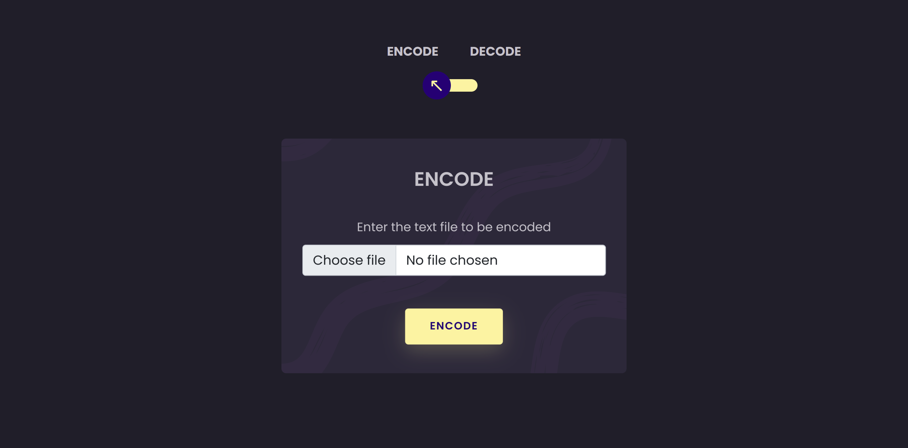
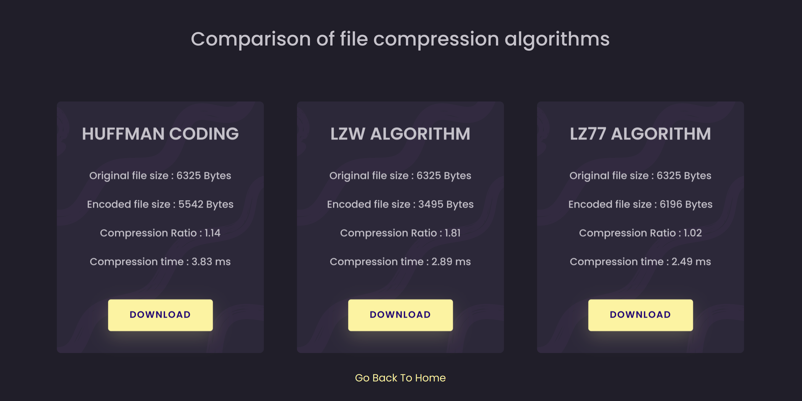
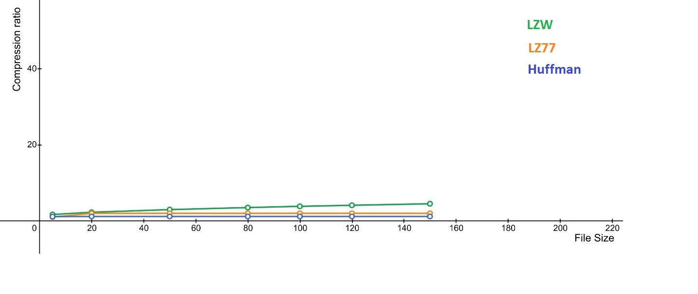
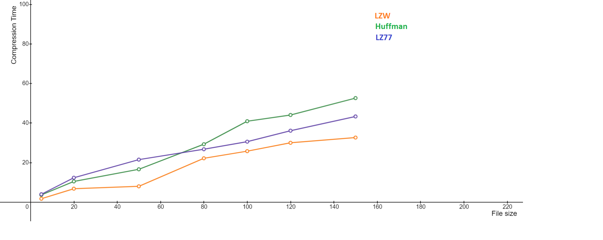

## File Compression

## Description

A simple web application to demonstrate the file encoding and decoding techniques using various algorithms like Huffman Coding, LZW Coding, LZ77 Coding and to analyse their compression time and compression ratio.

## To visit the site: 

[https://file-encode-decode.herokuapp.com/](https://file-encode-decode.herokuapp.com/)

## Pages Preview

## Performance analysis

## Setup

- Fork and clone the repo
- Run `npm run dev` after installing packages